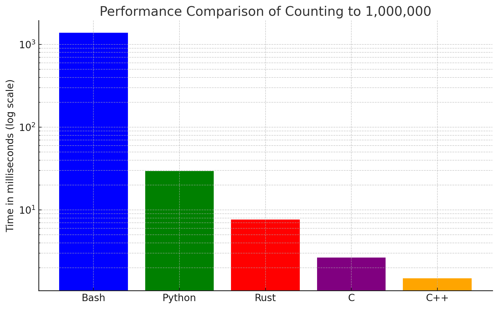

### Résultats des Tests de Performance

#### Méthodologie
Les tests ont été réalisés sur un seul système pour garantir la cohérence des conditions de test entre les cinq langages. Chaque programme a été exécuté individuellement avec pour seule tâche de compter jusqu'à 1 000 000, et le temps pris pour accomplir cette tâche a été mesuré en millisecondes.

#### Résultats
- **Bash**: Le script en Bash a pris **1381 ms** pour accomplir la tâche. Cela illustre la relative lenteur de Bash pour des opérations de boucle intensive, principalement due à son interprétation ligne par ligne et son manque d'optimisation pour de telles tâches.
- **Python**: Le script Python a exécuté la même tâche en **29.65 ms**, montrant une nette amélioration par rapport à Bash. Python bénéficie d'une meilleure optimisation pour les boucles, bien que toujours interprété, il est beaucoup plus rapide que Bash pour des tâches de calcul intensif.
- **Rust**: Le programme Rust a terminé la boucle en seulement **7.68 ms**, démontrant sa supériorité en termes de performance pour les tâches de bas niveau. Rust, étant un langage compilé avec des optimisations de performance avancées, offre une exécution très rapide, surtout pour le travail direct avec le système et la mémoire.
- **C**: Le programme en C a réalisé la tâche en **2.67 ms**, affichant d'excellentes performances dues à sa proximité avec le hardware et son exécution efficace de bas niveau.
- **C++**: Le programme en C++ a exécuté la tâche en **1.49 ms**, ce qui est le meilleur temps parmi tous les langages testés, démontrant les avantages du C++ en termes de performances optimisées et de contrôle direct sur les ressources système.

#### Analyse
Les différences observées entre les langages peuvent être attribuées à leurs paradigmes et mécanismes sous-jacents :
- **Bash** est principalement conçu pour l'automatisation des commandes et scripts dans les environnements UNIX/Linux, et non pour des performances de calcul intensif.
- **Python** est un langage haut niveau avec une vaste bibliothèque standard et un grand écosystème, optimisé pour une large gamme de tâches, mais il est limité par sa nature interprétée.
- **Rust** offre des performances proches de celles du C/C++, avec des garanties de sécurité supplémentaires, ce qui le rend idéal pour les applications nécessitant à la fois rapidité et fiabilité.
- **C** et **C++** fournissent les meilleures performances grâce à leur compilation directe en code machine et leur capacité à gérer finement la mémoire et les processus.

### Conclusion
Ces résultats confirment l'adéquation de Rust pour le projet SONAR, où la performance, la sécurité, et la précision sont critiques. Toutefois, les performances de C et C++ soulignent que dans des contextes où la vitesse pure est l'unique critère, ces langages pourraient être préférables. Rust demeure cependant un choix robuste pour un équilibre entre sécurité, facilité de maintenance et performance.

Voici le graphique qui montre les temps d'exécution pour compter jusqu'à 1 000 000 dans les langages Bash, Python, Rust, C et C++. Comme vous pouvez le voir, C++ et C sont les plus rapides, suivis de Rust, Python, et Bash étant le plus lent. L'échelle logarithmique aide à mieux visualiser les différences significatives entre les performances de chaque langage. Ce graphique peut être un excellent complément à votre mémoire pour illustrer visuellement les résultats de vos tests de performance.

